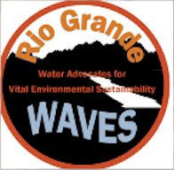

---
# Feel free to add content and custom Front Matter to this file.
# To modify the layout, see https://jekyllrb.com/docs/themes/#overriding-theme-defaults

layout: home
---

## Rio Grande Waves

### Regional water planning

[Lower Rio Grande Region Water Planning Open House](https://mainstreamnm.org/events/lower-rio-grande-region-water-planning-open-house-in-las-cruces/)

[NM Regional water planning](https://www.ose.nm.gov/Planning/rwp.php)

### Presentations from July 17 Healthy Waters, Healthy Futures

[Fred Phillips talk:Assessment of Impacts of Climate on New Mexico Water Resources over the Next 50 Years](Phillips Water-Climate_Las Cruces 2024.pdf)

[Peggy Barroll talk: Groundwater Levels and Groundwater Pumping in the Lower Rio Grande : Past, Present and Future ](Barroll GW Talk July 2024.pdf)

